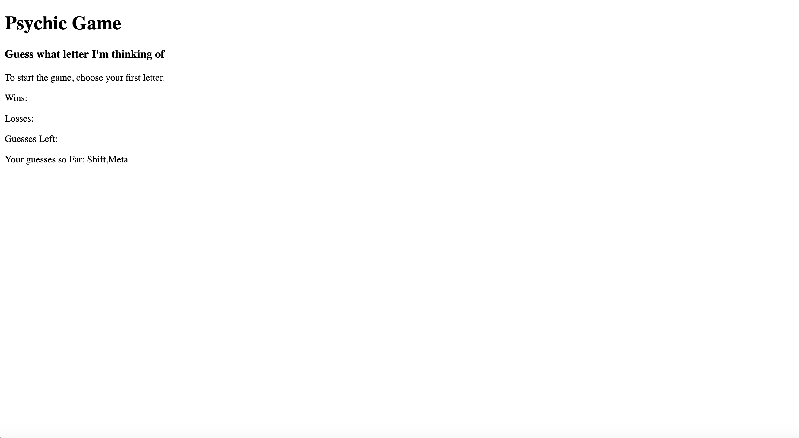

# Psychic-Game

## Summary

This contains the Psychic Game using Javascript.

## Site Picture



## Technologies Used

HTML- Creates the basic structure of the game.

Javascript - Scripts the functions to make the game work.

##Code Snipit

This snipit is the function that displays the numbers and letters in the game.

```javascript

function compareChoices(userGuess){
            
            guessedLetters.push(userGuess);
            guessText.textContent = "Your guesses so Far: " + guessedLetters;

            if(compChoice.indexOf(userGuess) !== -1){
                console.log(userGuess);
                if (userGuess === computerAnswer) {
                    wins++;
                    updateDom();
                    resetGame();
                    generateRandomComputerNum();
                   
                } else if (userGuess !== computerAnswer) {
                    guessCount--;
                    updateDom()
                    checkStatus();
                }

